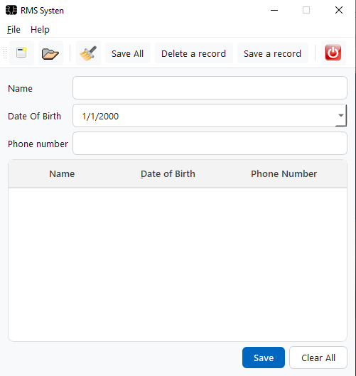
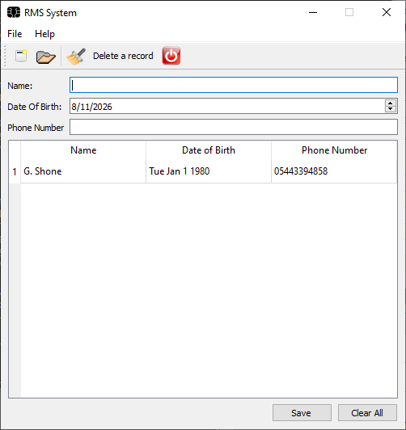

# 🛠️ Learning Qt: GUI Development & Practice Projects

> **Primary Reference:** *Getting Started with Qt 5* by Benjamin Baka  
> **Author:** Mahbod BemaniCham ([@Mahbodbe](https://github.com/Mahbodbe))  

---

  
  
  

  
  

---

## 🌐 English Version

### 📌 About This Repository
This repository documents my personal journey and hands-on practice in learning **Qt C++ GUI Framework** and **Qt Creator**. 

It contains code samples, structured exercises, and projects derived from:
1. **Primary Reference Book:** *Getting Started with Qt 5* written by **Benjamin Baka**.
2. **AI-Guided Exercises:** Custom exercises generated by AI assistants to practice specific framework concepts.

---

### 📂 Repository Structure

---

### 🚀 Curriculum & Lessons Map

#### [Chapter 1: Introduction](chapters/01-introduction/)
- **Introduction to Qt Creator Wizards:** Boilerplate template setup for simple desktop window applications.

#### [Chapter 2: Hello World](chapters/02-hello-world/)
- **Basic GUI Setup:** Launching simple QLabel windows.
- **Style Sheets:** Modifying look and feel inline and with  style states.

#### [Chapter 3: Basic Widgets & Layouts](chapters/03-basic-widgets/)
- **01-button-tooltip:** Setting QPushButton tooltips and custom icon loading.
- **02-label-alignment:** Text alignments and setting up Comic Sans typography.
- **03-form-grid-layouts:** Comparison and application of Form () and Grid () managers.
- **04-login-vbox-layout:** Designing standard login forms using Vertical layouts ().
- **05-url-exporter-hbox:** Designing Horizontal alignments ().

#### [Chapter 4: Signals & Slots](chapters/04-signals-slots/)
- **01-quit-connection:** Linking a button press to  slot.
- **02-dial-label-link:** Real-time data feed connection between  and a string-based label.
- **03-dial-lcd-label:** Advanced real-time multi-connection mapping one source trigger to multiple receiving widget slots.
- **04-slider-dial-sync:** Two-way connection loops synchronizing linear sliders with dials.

#### [Chapter 5: Main Window & Resources](chapters/05-mainwindow-resources/)
- **Progressive text editor/word processor application:**
  - **01-menubar-actions:** Registering action lists into File and Edit menus.
  - **02-toolbar-status:** Custom active toolbar with PNG icons and a status bar.
  - **03-open-file-slot:** Hooking up QFileDialog to open and read system files.
  - **04-save-file-slot:** Writing modified files back to system using stream buffers.
  - **05-text-edit-editor:** Fully functional combined rich text canvas editor.
  - **06-word-processor-full:** Complete feature-rich Notepad application.

#### [Chapter 6: Events and Drag & Drop](chapters/06-events-drag-drop/)
- **01-mouse-events:** Overriding  and  to intercept actions.
- **02-key-events:** Capturing physical keyboard inputs and printing custom log messages.
- **03-text-drag-drop:** Subclassing  into a custom class to intercept text drags.
- **04-file-drag-drop:** Overriding standard main window drag/drop rules to import files directly.

#### [Chapter 7: Databases & SQL](chapters/07-database-sql/)
- **01-connection-odbc:** Establishing a connection to a MySQL server via .
- **02-select-query:** Executing SQL queries and parsing row elements.
- **03-bind-insert:** Secure parametric SQL values insertion (positional and named binds).
- **04-sql-crud:** Full cycle SQL transaction testing (INSERT, UPDATE, DELETE).
- **05-sql-table-model:** Utilizing  and its submit strategies.
- **06-sql-table-view:** Visualizing and live-modifying database tables on screen using .

---

### 🏆 Showcase Project: Record Management System
A standalone desktop suite located under  demonstrating full framework synergy:
- **Rich Spreadsheet UI:** Visualizing lists with sorting and searching.
- **JSON & CSV Storage:** Importing and exporting local database files.
- **MySQL Integration:** Writing and syncing large tables safely using database transactions.
- **Unsaved Changes Interceptor:** Dialog prompts checking state before exiting or creating new files.

---

### 💻 Requirements
- **Qt Framework** (Qt 5.12+ / Qt 6.x)
- **Qt Creator IDE** (or MSVC with Qt extension)
- **C++ Compiler** (GCC, Clang, or MSVC)
- **ODBC Driver** (for MySQL Database chapters)

---

### 🛠️ How to Build
1. Open **Qt Creator**.
2. Select .
3. Open any  project file (e.g. ).
4. Click **Configure Project** and press  to compile and launch.

---

### 📸 UI Screenshots

#### Showcase: Record Management System (RMS)

*Placeholder: Capture the main application window displaying the loaded table records and operational buttons.*

#### Text Editor Application

*Placeholder: Capture the Word Processor application with active toolbar, custom icons, and file actions.*

---

## 👥 Author
* **Mahbod BemaniCham** — [@Mahbodbe](https://github.com/Mahbodbe)
<!-- force update -->
